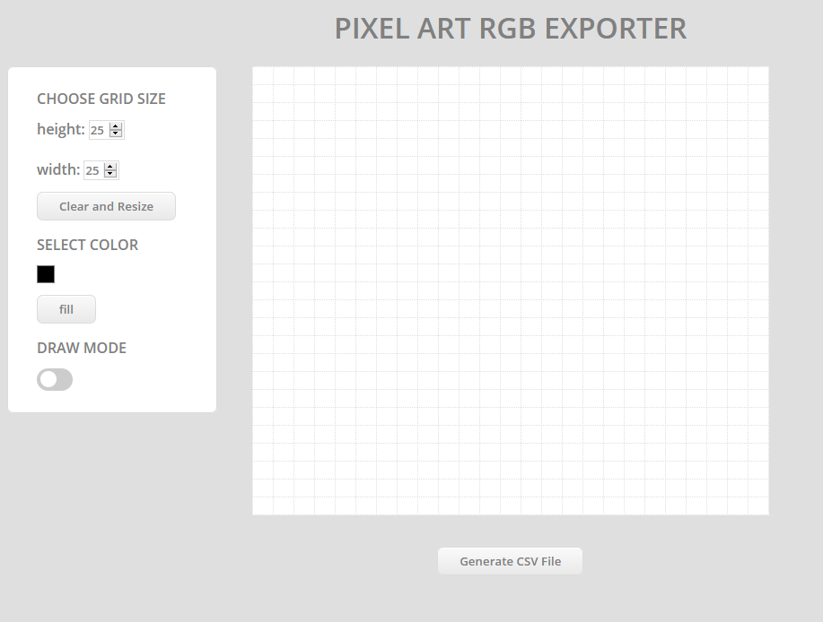

# Pixel Art Exporter

## For use
[Pixel Art Explorer](https://pixelartexporter.herokuapp.com/)

## Usage
After drawing any simple sketech. The design can be exported as a RGB matrix.
For E.g A black 4x4 Pixel image would be exported as 

```
[
    [0,0,0],
    [0,0,0],
    [0,0,0],
    [0,0,0]
]
```
